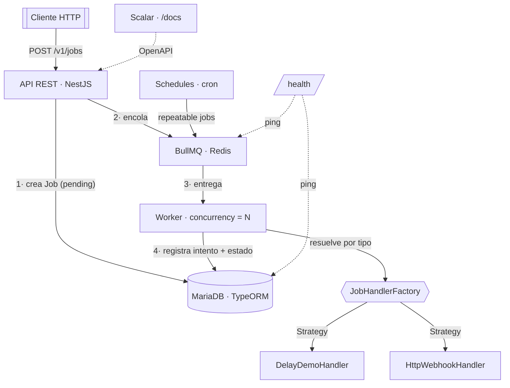

# QueueForge

Microservicio **procesador de colas** construido con **NestJS**: ejecuta jobs
asíncronos ("promesas") con **concurrencia acotada**, mantiene un **historial**
completo de ejecuciones, soporta **jobs recurrentes (cron)** y está pensado para
desplegarse en **N ambientes** y escalar horizontalmente.

- **Cola y concurrencia:** BullMQ sobre Redis (reintentos con backoff, rate limiting, cron).
- **Persistencia e historial:** MariaDB con TypeORM (fuente de verdad y auditoría).
- **Handlers pluggables:** cada tipo de job es una *estrategia* resuelta por una *factory*.
- **Documentación interactiva:** Scalar en `/docs` a partir del OpenAPI.
- **Calidad:** TDD con cobertura ≥ 90 %, ESLint + Prettier, Husky + commitlint.

---

## Tabla de contenidos

- [Arquitectura](#arquitectura)
- [Stack tecnológico](#stack-tecnológico)
- [Estructura del proyecto](#estructura-del-proyecto)
- [Requisitos previos](#requisitos-previos)
- [Puesta en marcha](#puesta-en-marcha)
- [Despliegue en N ambientes](#despliegue-en-n-ambientes)
- [Uso de la API](#uso-de-la-api)
- [Cómo funciona](#cómo-funciona)
- [Tests y cobertura](#tests-y-cobertura)
- [Git hooks](#git-hooks)
- [Scripts disponibles](#scripts-disponibles)

---

## Arquitectura

QueueForge separa responsabilidades en dos piezas de infraestructura:

- **Redis + BullMQ** → el **motor de cola**: concurrencia, reintentos con backoff,
  y la recurrencia tipo cron (repeatable jobs).
- **MariaDB + TypeORM** → la **fuente de verdad y el historial**: definición de jobs,
  cada intento de ejecución y los schedules.



### Capas (un propósito por módulo)

| Módulo | Responsabilidad |
| --- | --- |
| `config` | Carga y **valida** la configuración por ambiente (Joi) y la expone tipada. |
| `persistence` | TypeORM: entidades, repositorios (repository pattern) y migraciones. |
| `queue` | BullMQ: productor, worker (concurrencia) y los **handlers** + su **factory**. |
| `jobs` | Casos de uso de jobs: encolar, listar, consultar, historial, cancelar. |
| `schedules` | Jobs recurrentes (cron) ↔ repeatable jobs de BullMQ. |
| `health` | Liveness/readiness de MariaDB y Redis. |
| `common` | Filtro de excepciones, interceptor de logging, builders y excepciones de dominio. |

### Flujo de datos

1. Un job se crea vía `POST /jobs` (o lo dispara un schedule por cron).
2. Se **persiste** un `Job` (estado `pending`) en MariaDB y se **encola** en BullMQ.
3. El **worker** toma el job según la **concurrencia** configurada y resuelve su
   handler con `JobHandlerFactory` (sin `switch`).
4. Cada intento escribe una fila `JobExecution` (inicio, fin, duración, error, worker)
   — el **historial** — y actualiza el estado del `Job`. BullMQ aplica los reintentos.

### Patrones de diseño

- **Strategy** — `JobHandler`: cada tipo de job implementa la misma interfaz.
- **Factory** — `JobHandlerFactory`: registro `tipo → handler`, resuelto por clave
  (sustituye a un `switch` y es extensible sin tocar el código existente).
- **Builder** — `JobOptionsBuilder`: construye las opciones de BullMQ de forma fluida.
- **Repository** — repositorios que encapsulan TypeORM para mantener la lógica testable.

---

## Stack tecnológico

| Área | Tecnología |
| --- | --- |
| Framework | NestJS 11 (TypeScript) |
| Cola / workers | BullMQ 5 + Redis |
| Base de datos / ORM | MariaDB + TypeORM 1 |
| Validación | class-validator / class-transformer · Joi (env) |
| Documentación | @nestjs/swagger (OpenAPI) + Scalar |
| Salud | @nestjs/terminus |
| Tests | Jest (unitarios + e2e con Supertest) |
| Calidad | ESLint + Prettier · Husky · lint-staged · commitlint |

---

## Estructura del proyecto

```
src/
├── config/         # Configuración tipada + validación Joi
├── persistence/    # TypeORM: entities, repositories, migrations, data-source
├── queue/          # BullMQ: producer, processor, handlers/, factory
├── jobs/           # API + casos de uso de jobs
├── schedules/      # API + casos de uso de schedules (cron)
├── health/         # Health checks (MariaDB + Redis)
├── common/         # filtros, interceptors, builders, excepciones
├── app.module.ts
└── main.ts         # bootstrap + Scalar + ValidationPipe + shutdown
test/               # pruebas e2e
```

---

## Requisitos previos

- **Node.js** ≥ 20 y **pnpm** ≥ 9
- **MariaDB** ≥ 10.6 (la instalada en tu PC) — o vía Docker
- **Redis** ≥ 6 (en Windows lo más práctico es vía Docker)

---

## Puesta en marcha

```bash
# 1) Instalar dependencias
pnpm install

# 2) Configurar variables de entorno
cp .env.example .env.development      # ajusta credenciales de tu MariaDB local

# 3) Infraestructura
#    a) Si usas la MariaDB de tu PC, levanta solo Redis:
docker compose up -d redis
#    b) O levanta MariaDB + Redis con Docker:
docker compose up -d

#    (crea la base de datos si no existe)
#    CREATE DATABASE queueforge;

# 4) Crear el esquema (migraciones)
pnpm migration:run

# 5) (Opcional) Poblar con datos de ejemplo para explorar la app
pnpm seed

# 6) Arrancar en modo desarrollo (watch)
pnpm start:dev
```

La API queda en `http://localhost:3000`. Documentación interactiva en
`http://localhost:3000/docs`.

### Producción

```bash
pnpm build
NODE_ENV=production pnpm start:prod
```

---

## Despliegue en N ambientes

La aplicación es **stateless** y sigue 12-factor: toda la configuración llega por
variables de entorno.

- Se carga `.env.${NODE_ENV}` (p. ej. `.env.staging`, `.env.production`) y se **valida
  con Joi** al arrancar: si falta o es inválida una variable, el proceso falla de
  inmediato (fail-fast).
- Como el estado vive en MariaDB (historial) y Redis (cola), puedes ejecutar **varias
  instancias en paralelo**: BullMQ reparte los jobs entre los workers y el historial
  registra **qué instancia** ejecutó cada intento (`workerId`).
- Ajusta `QUEUE_CONCURRENCY` por instancia según los recursos del ambiente.

| Variable | Descripción | Por defecto |
| --- | --- | --- |
| `NODE_ENV` | Entorno activo | `development` |
| `PORT` | Puerto HTTP | `3000` |
| `DB_HOST` / `DB_PORT` | MariaDB | `localhost` / `3306` |
| `DB_USERNAME` / `DB_PASSWORD` / `DB_DATABASE` | Credenciales | `root` / `root` / `queueforge` |
| `DB_SYNCHRONIZE` | Sincroniza esquema (solo test/e2e) | `false` |
| `REDIS_HOST` / `REDIS_PORT` / `REDIS_PASSWORD` | Redis | `localhost` / `6379` / — |
| `QUEUE_CONCURRENCY` | Jobs en paralelo por instancia | `5` |
| `QUEUE_MAX_ATTEMPTS` | Reintentos por job | `3` |
| `QUEUE_BACKOFF_MS` | Backoff base entre reintentos (ms) | `1000` |
| `QUEUE_DISPATCH_CRON` | Cron del despachador de pendientes (override: BD) | `*/10 * * * * *` |
| `RATE_LIMIT_TTL` | Ventana del rate limit (ms) | `60000` |
| `RATE_LIMIT_LIMIT` | Peticiones máx. por ventana y cliente | `100` |

---

## Uso de la API

La API está **versionada por URI**: todos los endpoints cuelgan de `/v1` (p. ej.
`/v1/jobs`). El health check (`/health`) es neutral a la versión para los orquestadores.

Documentación interactiva (Scalar): **`/docs`** · OpenAPI JSON: **`/openapi.json`**

### Jobs

```bash
# Encolar un job
curl -X POST http://localhost:3000/v1/jobs \
  -H 'content-type: application/json' \
  -d '{ "type": "delay-demo", "payload": { "delayMs": 500 } }'

# Listar (con filtros y paginación)
curl 'http://localhost:3000/v1/jobs?status=completed&page=1&limit=20'

# Consultar un job
curl http://localhost:3000/v1/jobs/<id>

# Ver el historial de ejecuciones
curl http://localhost:3000/v1/jobs/<id>/executions

# Cancelar un job pendiente/en cola
curl -X DELETE http://localhost:3000/v1/jobs/<id>
```

### Schedules (cron)

```bash
# Crear un job recurrente (cada minuto)
curl -X POST http://localhost:3000/v1/schedules \
  -H 'content-type: application/json' \
  -d '{ "name": "ping-cada-minuto", "type": "delay-demo",
        "cronExpression": "*/1 * * * *", "payload": { "delayMs": 50 } }'

# Activar / desactivar
curl -X PATCH http://localhost:3000/v1/schedules/<id> \
  -H 'content-type: application/json' -d '{ "enabled": false }'

# Eliminar
curl -X DELETE http://localhost:3000/v1/schedules/<id>
```

### Health

```bash
curl http://localhost:3000/health   # estado de MariaDB y Redis
```

---

## Cómo funciona

- **Concurrencia:** el worker procesa hasta `QUEUE_CONCURRENCY` jobs en paralelo;
  el valor se aplica al arrancar desde la configuración.
- **Reintentos:** ante un fallo, BullMQ reintenta hasta `maxAttempts` con backoff
  exponencial; cada intento queda registrado en el historial.
- **Historial:** cada `JobExecution` guarda intento, estado, inicio/fin, duración,
  error y `workerId`, lo que permite auditar reintentos y rendimiento.
- **Cron:** un `Schedule` se traduce en un *repeatable job* de BullMQ; en cada disparo
  se crea el `Job` correspondiente y se actualiza `lastRunAt`.
- **Despachador (red de seguridad):** un cron interno reencola periódicamente los jobs
  que quedaron en estado `PENDING` (por un reinicio, un fallo al encolar o un seed),
  reclamándolos de forma atómica para que sea seguro con varias instancias. Su frecuencia
  es **configurable sin redeploy**: se resuelve con precedencia **base de datos**
  (ajuste `queue.dispatch.cron` en la tabla `settings`) **→ variable de entorno**
  (`QUEUE_DISPATCH_CRON`) **→ valor por defecto**.
- **Tipos de job pluggables:** el catálogo de tipos es el enum `JobType`. Para añadir uno
  nuevo: agrega su valor a `JobType`, implementa el `JobHandler`, decláralo como provider y
  añádelo al proveedor `JOB_HANDLERS`. No hay que tocar el worker. Un `type` que no esté en
  el enum se rechaza con **400** en la validación del DTO.
- **Rate limiting:** la API aplica un límite de peticiones por cliente (vía
  `@nestjs/throttler`), configurable con `RATE_LIMIT_TTL` y `RATE_LIMIT_LIMIT`. El health
  check (`/health`) queda exento. Al superarlo se responde **429 Too Many Requests**.

---

## Tests y cobertura

```bash
pnpm test           # unitarios
pnpm test:cov       # unitarios + cobertura (umbral global del 90 %)
pnpm test:e2e       # e2e (requiere MariaDB + Redis en marcha)
```

El proyecto se desarrolla con **TDD**. La cobertura se mide sobre la lógica de negocio
(servicios, factory, handlers, builders, filtros) y exige **≥ 90 %** en ramas, funciones,
líneas y sentencias; la integración con infraestructura se cubre con los tests **e2e**.

---

## Git hooks

Gestionados con **Husky**:

- **pre-commit:** `lint-staged` (ESLint + Prettier sobre lo *staged*) y la suite de tests
  con cobertura — **bloquea el commit** si fallan los tests o la cobertura baja del 90 %.
- **commit-msg:** `commitlint` exige mensajes con formato
  [Conventional Commits](https://www.conventionalcommits.org/).

---

## Scripts disponibles

| Script | Descripción |
| --- | --- |
| `pnpm start:dev` | Arranque en watch |
| `pnpm start:prod` | Arranque del build de producción |
| `pnpm build` | Compila a `dist/` |
| `pnpm lint` | ESLint con autofix |
| `pnpm format` | Prettier |
| `pnpm test` / `test:cov` / `test:e2e` | Tests |
| `pnpm migration:run` / `migration:revert` | Migraciones TypeORM |
| `pnpm migration:generate <ruta>` | Genera una migración a partir de las entidades |
| `pnpm seed` | Puebla la BD con datos de ejemplo (idempotente) |
